# Actividad Kubernetes: Despliegue de `store-app` en Minikube

**Descripción:** Inspecciono el estado general del clúster con `kubectl get all` para ver pods, deployments y servicios.
Esto muestra qué recursos están desplegados y si hay pods con problemas o servicios en espera.

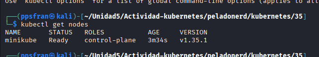

**Descripción:** Compruebo el endpoint de `store-app` con `kubectl get endpoints store-app` para ver IP y puerto.
Esto confirma si el servicio está enlazado correctamente a sus pods y es accesible internamente.

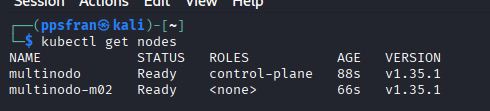

**Descripción:** Observo la advertencia deprecada `Endpoints` en Kubernetes y verifico el estado del servicio.
Sirve para entender si la versión de `kubectl` o del clúster necesita actualización o ajuste.

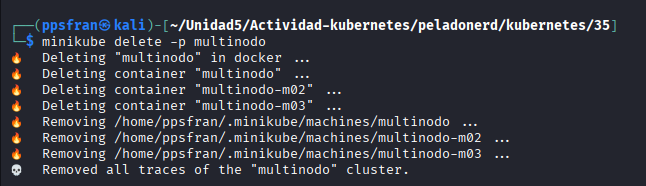

**Descripción:** Elimino el clúster `multinodo` usando `minikube delete -p multinodo` para liberar recursos.
Esto borra los nodos, contenedores y configuración del clúster anterior antes de crear uno nuevo.

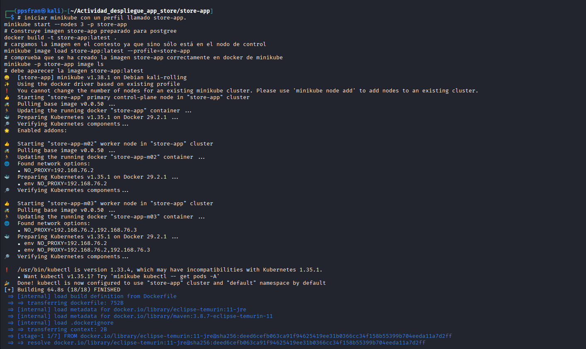

**Descripción:** Inicio Minikube con el perfil `store-app` y construyo la imagen Docker para la app.
Aquí se prepara el entorno y se carga la imagen en Minikube para poder desplegarla en el cluster.

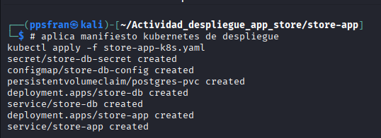

**Descripción:** Aplico el manifiesto `store-app-k8s.yaml` con `kubectl apply -f` para crear recursos Kubernetes.
Esto crea secret, configmap, PVC, deployments y servicios necesarios para la app y la base de datos.

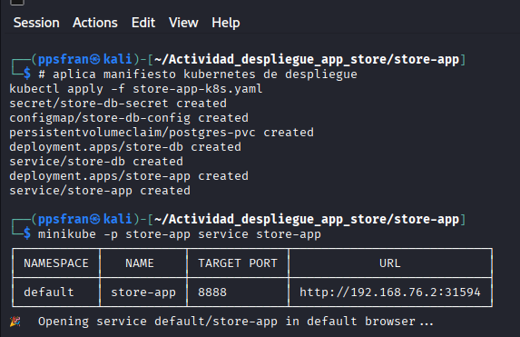

**Descripción:** Expongo el servicio `store-app` con `minikube service store-app` para obtener la URL de acceso.
Así puedo abrir la aplicación en el navegador usando la IP y el puerto que Minikube asigna.

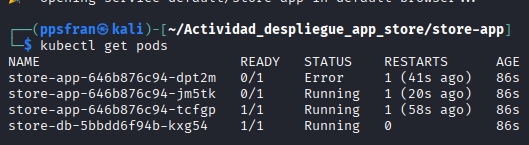

**Descripción:** Verifico los pods con `kubectl get pods` y reviso qué contenedores están en error o arrancando.
Esto me permite detectar pods con estado `CrashLoopBackOff` o reinicios antes de seguir depurando.

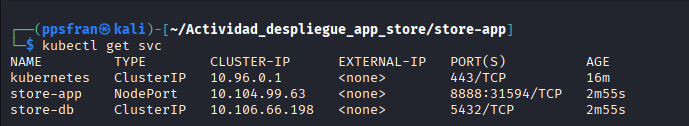

**Descripción:** Muestro cómo navego a la ruta correcta del proyecto antes de lanzar Minikube.
Esto es útil para tener claro el directorio de trabajo donde están los archivos de Kubernetes.

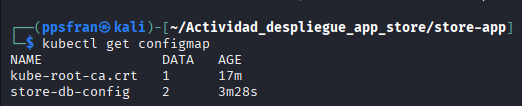

**Descripción:** Inicio Minikube con Docker y reviso mensajes de compatibilidad con `kubectl` y Kubernetes.
Fíjate en el aviso sobre la versión de `kubectl` frente a la versión de Kubernetes del cluster.

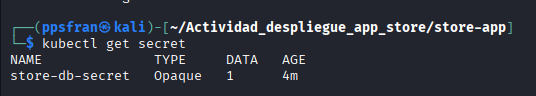

**Descripción:** Compruebo otra vez el estado de los pods después de iniciar el cluster y aplicar los manifiestos.
Aquí se ve si los pods del despliegue ya están `Running` o si todavía hay fallos que resolver.

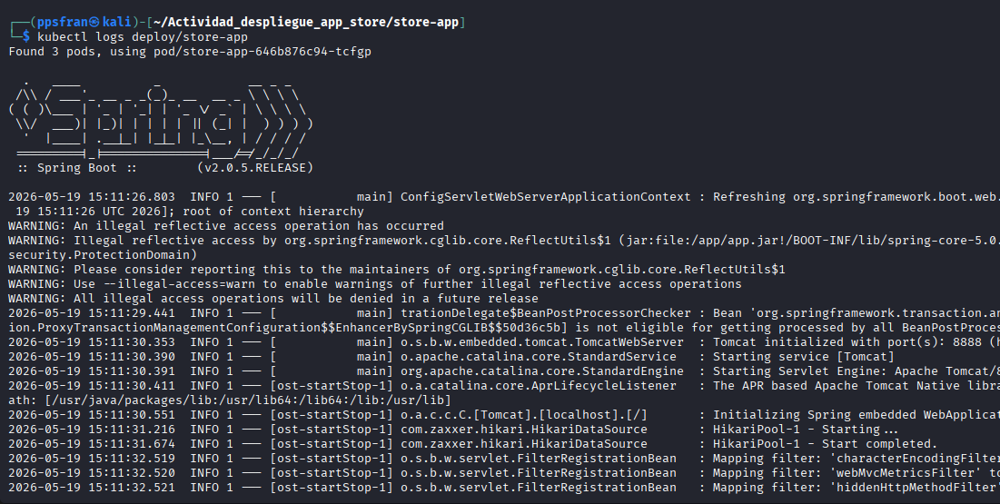

**Descripción:** Reviso los logs detallados de arranque de Minikube y del proceso de creación del cluster.
Sirve para detectar errores en la inicialización del nodo o problemas con la imagen Docker.

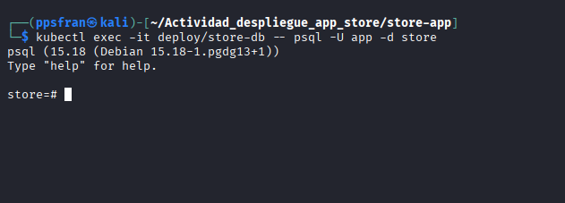

**Descripción:** Registro el comando `minikube start` en la ruta `Actividad-kubernetes/peladonerd/kubernetes/35`.
Muestra el proceso de arranque desde esa carpeta y la configuración del perfil del cluster.

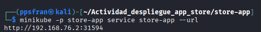

**Descripción:** Veo los mensajes de configuración del clúster, como detección de driver Docker y addons habilitados.
Esto confirma que Minikube está validando correctamente los componentes del cluster antes de iniciar.

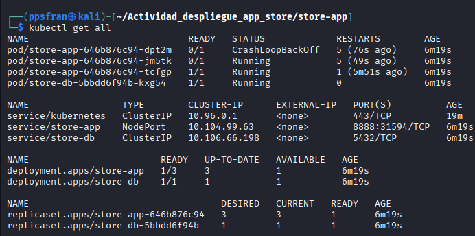

**Descripción:** Ejecuto `kubectl get pods` para ver el estado final de los pods del despliegue `store-app`.
Se observa un pod con estado de error y reinicios, lo que indica que hay que depurar el contenedor.

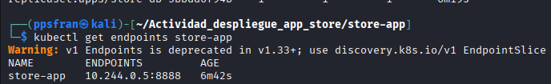

**Descripción:** Reviso el estado completo del clúster y la disponibilidad de los pods tras el despliegue.
Esta última captura muestra si el despliegue y los servicios quedaron correctamente creados.